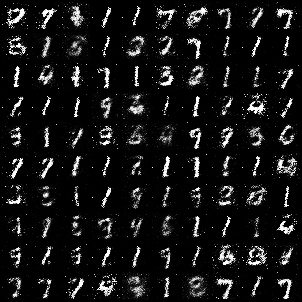
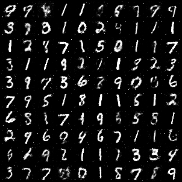

# MNIST Digit Generator using Generative Adversarial Networks

The MNIST database of handwritten digits, has a training set of 60,000 examples, and a test set of 10,000 examples. It is a subset of a larger set available from NIST. The digits have been size-normalized and centered in a fixed-size image. 

## Installation

Use the google colab with GPU for training of the model.

## Contributing
Pull requests are welcome. For major changes, please open an issue first to discuss what you would like to change.

Please make sure to update tests as appropriate.

## Outputs : 

<h2> Please refer the .avi file for a video output of all the images combined <h2>

Output at Epoch 1:

Output at Epoch 50:

Output at Epoch 100:

